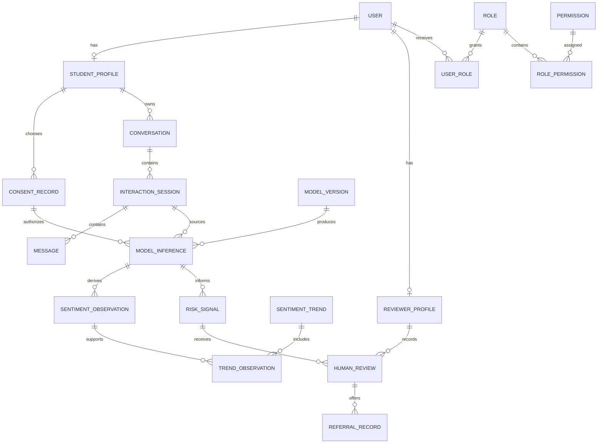

# Database architecture

PamatiAI stores sentiment/affect analysis and support-oriented signals, **not clinical diagnoses**. RiskSignal is a human-review decision-support record, not evidence of a psychiatric condition. No diagnoses, prescriptions, biometric templates, images, video or waveform payload columns exist.

## Engine and conventions

Target: MySQL 8.4, InnoDB, `utf8mb4` / `utf8mb4_0900_ai_ci`. Every domain table declares its encoding explicitly. UUID strings (`VARCHAR(36)`) provide opaque identifiers. Profile primary keys are also foreign keys to User; analysis primary keys are also foreign keys to ModelInference. Junction tables use composite primary keys. UTC `DATETIME(6)` values preserve microseconds; application writes use UTC-naive values deliberately, never machine-local time. UUIDs and timestamps are SQLAlchemy defaults; direct SQL writers must provide them explicitly.

Mutable records have `updated_at`; domain entities have `created_at`. Users, profiles, conversations, sessions, messages, inference records, observations, trends, risk signals, referrals, notifications, research memberships and media references support `deleted_at`. This is a visibility marker, **not erasure**. Analysis rows inherit visibility from their parent inference. Consent receipts, model revisions, review decisions and audit events preserve history rather than soft-delete silently. Foreign keys use RESTRICT: deletion must explicitly address dependent records and their retention obligations. No student graph is silently cascaded away.

## Entity map

| Entity / table | Relationships and purpose |
| --- | --- |
| User / users | Unique email, Argon2 password hash, activity state, development-account flag; optional one-to-one student/reviewer profiles. No password plaintext. |
| Role / roles | Unique role code; many-to-many users and permissions. COUNSELOR represents counselor/authorized reviewer. |
| Permission / permissions | Unique permission code. Ownership, assignment and consent remain mandatory in addition to a role grant. |
| StudentProfile / student_profiles | User PK/FK, unique research pseudonym; no unnecessary health/demographic fields. Pseudonymization is not anonymization. |
| ReviewerProfile / reviewer_profiles | User PK/FK, optional professional title; profile presence alone does not authorize content access. |
| ConsentRecord / consent_records | Student FK, unique student/version, policy version, independent permissions and withdrawal time. Append a new receipt for changed choices. |
| Conversation / conversations | Student FK, open/closed state; one-to-many sessions. No default sensitive title metadata. |
| InteractionSession / interaction_sessions | Composite conversation/student FK, session start/end; one-to-many messages and inference jobs. |
| Message / messages | Composite session/student FK, sender, unique session/sequence, optional text; basic text chat has no audio/visual consent dependency. |
| TextAnalysis / text_analyses | One-to-one text inference, language, label probabilities and limitations. |
| AudioAnalysis / audio_analyses | One-to-one audio inference, nonnegative duration, labels and limitations; no duplicated transcript or raw waveform. |
| VisualAnalysis / visual_analyses | One-to-one visual inference, nonnegative frame count, labels and limitations; no identity/biometric template. |
| MultimodalAnalysis / multimodal_analyses | One-to-one fusion inference, fusion strategy revision, missing modalities, labels and limitations. |
| SentimentObservation / sentiment_observations | Student/inference FK, unique inference/dimension, score in [-1,1], observation timestamp. Requires completed source and active longitudinal consent. |
| SentimentTrend / sentiment_trends | Student/consent FK, model revision, dimension, algorithm revision, half-open time window, sample count and summary. Evidence joins preserve source observations. |
| RiskSignal / risk_signals | Student-scoped inference and/or trend evidence, rule version, explanation, attention priority and review status. No autonomous clinical decision. |
| HumanReview / human_reviews | Student-scoped signal FK, reviewer FK, timestamp, human decision and optional restricted notes. Appended decisions preserve history. |
| ReferralRecord / referral_records | Student-scoped HumanReview FK, service reference, offered/accepted/declined/closed state and student-decision timestamp. No treatment prescription. |
| Notification / notifications | Recipient FK, unique deduplication key, template/channel, dispatch state, retries, schedule/sent times. No conversation text, media or risk narrative in notifications. |
| AuditLog / audit_logs | Optional actor FK, action, resource reference, outcome and request correlation. MySQL triggers reject UPDATE/DELETE; no sensitive event payload. |
| ModelVersion / model_versions | Unique identifier/version/modality, optional artifact digest/license/model card and configuration. MySQL forbids revision mutation. |
| ModelInference / model_inferences | Student, session, optional message, consent receipt, model revision, modality, timestamps, preprocessing/adapter versions, status, nullable confidence and uncertainty. |
| ResearchDatasetRecord / research_dataset_records | Student-scoped inference and consent receipt, dataset/version, ethics approval, deidentification revision, split and revocation. No exported payload or raw media. |
| SystemSetting / system_settings | Unique key, JSON configuration, update time and optional actor. Never store secrets here. |

Supporting normalized tables: `user_roles`, `role_permissions`, `reviewer_assignments`, `fusion_inputs`, `trend_observations`, `media_assets`. These bring the schema to 30 domain tables, plus Alembic's version table. Reviewer assignments are revocable and unique per student/reviewer pair. Renewing an assignment updates that record and requires an audit event in the future workflow.



## Ownership and indexes

Composite foreign keys carry student ownership through conversations, sessions, messages, consent receipts, inferences, fusion inputs, observations, trends, signals, reviews, referrals and research memberships. Linking an otherwise valid identifier from another student fails in MySQL. Redundant `(id, student_id)` unique keys are deliberate ownership anchors, not duplicated content. Composite model/modality keys and analysis CHECK constraints prevent a text output from masquerading as audio or visual analysis.

Indexes support student/time conversation and inference queries, student/time observations, trend windows, signal review queues, processing status/time workers, notification dispatch, reviewer assignments, audit actor/resource/time and media expiry. Unique constraints prevent duplicate emails, permission/role codes, message sequence numbers, model revisions, observation dimensions, notifications and dataset/inference memberships. All foreign-key columns are indexed explicitly or by InnoDB's required supporting index.

## Consent semantics

Independent permissions: `text_processing`, `audio_processing`, `visual_processing`, `longitudinal_tracking`, `research_data_use`. All default false. Extra independent choices: `reviewer_access`, `retain_audio`, `retain_visual`. Raw retention requires its corresponding processing permission. A declined audio/visual choice never prevents creating a text message, conversation or session. Declining text **analysis** also does not prevent basic text-chat persistence; conversational storage notices and policies must be implemented before participant use.

The highest receipt version is current, not merely the newest granted receipt. A withdrawn latest receipt does not reactivate an older grant. Policy/permission fields cannot be rewritten and receipts cannot be deleted by runtime writes; append a full new choice snapshot with a higher version. Governed erasure of the consent history requires separately privileged maintenance. The transaction helper locks StudentProfile to serialize consent changes and processing writes. Omitted choices in a new snapshot default false. MySQL independently gates inference insertion, start/completion, trend creation, research membership and media insertion. Use the same student-lock protocol for future worker completion, research export, fusion publication and privacy workflows to avoid races with withdrawal; raw SQL access is not a substitute for this protocol.

`withdraw_consent` cancels pending/running jobs and marks existing research memberships revoked. Physical media deletion and revocation of previously exported datasets require future workers; this stage does not claim those external workflows exist. Historical completed inferences remain provenance records until a reviewed retention/erasure workflow removes or anonymizes them. Read authorization must recheck current consent and deletion state.

## Inference reproducibility

Each inference preserves a mandatory ModelVersion FK whose immutable row retains the model identifier, exact version and modality. It also retains its own modality, creation/start/completion timestamps, preprocessing and adapter revisions, consent receipt and processing status (`pending`, `running`, `completed`, `failed`, `cancelled`, `abstained`). Confidence is nullable and constrained to [0,1]; uncertainty is nullable structured JSON accompanied by an optional method identifier. NULL means unavailable, never a fabricated certainty. ModelVersion configuration can record seed, tokenizer revision, hardware and evaluation references without sensitive inputs.

Inference source/provenance fields cannot change. Completed/abstained runs require timestamps; running jobs require a start time. Terminal inference status and measured outputs cannot be overwritten: create a new run for reprocessing. Structured error codes must exclude inputs or credentials. Modality analysis records hold method-specific outputs; all readers must honor the parent inference status and deletion state.

Fusion evidence must come from completed, consented unimodal runs belonging to the same student and session. Missing audio/visual inputs remain explicitly missing. Trend evidence must match student, model revision, dimension and half-open observation window. Application aggregation must verify sample counts against evidence joins and compute actual summaries; this database stage does not fabricate trends or run models. Research INSERT guards prevent one student spanning splits within a dataset version; future exporters must also serialize writes using the student lock and preserve that partition across dataset refreshes.

## Privacy, raw media and audit

No binary media is stored in MySQL. MediaAsset contains only an opaque private object reference and mandatory expiry/purge metadata. Creation requires all three gates: `ALLOW_RAW_MEDIA_STORAGE=true`, `system_settings.raw_media_retention.value.enabled=true`, and an active latest receipt granting processing **and** raw retention for that modality. Both configuration gates default disabled. References cannot be changed and expiry cannot be extended by updating an existing asset. Storage encryption, short-lived access, physical expiry purge and consent-withdrawal deletion are mandatory before enabling a real object-store integration.

Soft deletion does not automatically hide records from arbitrary ORM queries; future repository/API methods must filter it and apply resource authorization. Hard erasure needs an explicit ordered retention workflow. An audited actor may remain as a deidentified user tombstone because RESTRICT protects append-only events. Audit deletion/retention must use separately governed privileged maintenance, not runtime application permissions. Do not place student narratives, diagnoses, secrets or raw inputs in JSON configurations/explanations. Human notes and chat text are sensitive, despite having no media columns.

## Migrations, initialization and seeds

Revisions: `0001_foundation` (existing baseline), `0002_research_schema` (30 tables), `0003_persistence_guards` (consent/provenance/audit triggers), `0004_evidence_integrity` (lifecycle checks and evidence/reviewer guards). They are explicit migrations, independent of future ORM changes. Migration credentials need DDL and TRIGGER privileges. Production runtime credentials should only have necessary SELECT/INSERT/UPDATE rights, no schema or trigger management, no model-revision updates, and no audit UPDATE/DELETE. Separate initialization credentials may create the database; Compose already provisions it.

From `pamati-ai/backend`, after configuring DATABASE_URL:

```powershell
../.venv/Scripts/python.exe -m app.database_commands init
../.venv/Scripts/python.exe -m app.database_commands seed
../.venv/Scripts/python.exe -m alembic current
../.venv/Scripts/python.exe -m alembic check
```

`init` creates the named database idempotently and runs Alembic. Database names are validated before quoting. `seed` adds roles, permissions and the disabled media gate transactionally. It rejects unexpected existing role grants rather than silently resetting policy. PowerShell wrappers are available in `scripts/init_database.ps1` and `scripts/seed_database.ps1`.

Development accounts require explicit opt-in, ENVIRONMENT=development and a supplied password of at least 16 characters. There are no built-in passwords:

```powershell
$env:DEV_SEED_PASSWORD = [System.Net.NetworkCredential]::new('', (Read-Host 'Development password' -AsSecureString)).Password
../.venv/Scripts/python.exe -m app.database_commands seed --development-accounts
Remove-Item Env:DEV_SEED_PASSWORD
```

Accounts: `dev.student@pamati.example`, `dev.reviewer@pamati.example`, `dev.admin@pamati.example`. Each has one role, an Argon2id password hash, `is_development_account=true` and a `[DEVELOPMENT ONLY]` display name. Reviewer/student profiles are created as needed. Administrators receive only account/configuration grants. Seeds create no consent receipts, assignments, conversations or analysis results. Existing passwords/grants are never reset. Authentication endpoints and institutional onboarding are documented in [AUTHENTICATION.md](AUTHENTICATION.md).

With Compose, the migrate service upgrades the schema. Seed roles using:

```powershell
docker compose run --rm backend python -m app.database_commands seed
# For explicit development accounts, set DEV_SEED_PASSWORD as above, then:
docker compose run --rm -e DEV_SEED_PASSWORD backend python -m app.database_commands seed --development-accounts
Remove-Item Env:DEV_SEED_PASSWORD
```

## Tests and migration validation

Unit tests still run without MySQL. Real database tests require a dedicated MySQL database whose name ends in `_test`. Configure TEST_DATABASE_URL to a mysql+pymysql URL with charset=utf8mb4; never point it at participant data. Tests apply migrations and roll back fixture writes; they do not drop tables or delete committed data.

```powershell
# Supply an isolated _test database URL through your local environment.
../.venv/Scripts/python.exe -m pytest
../.venv/Scripts/python.exe -m ruff check app ../tests/backend ../database/migrations
```

Validated on a workspace-local MySQL 8.4.4 server bound only to loopback: full upgrade, downgrade to base, re-upgrade, no Alembic drift, seed idempotency, Argon2 hashes, utf8mb4 emoji/non-Latin round-trip, ownership rejection, consent withdrawal/supersession, retention gates, terminal inference integrity, evidence constraints, reviewer assignment gates and audit append-only enforcement. See VALIDATION.md for current test counts. Docker remains unavailable in the creation environment; Compose image execution is not claimed as validated.

Implementation references: [SQLAlchemy composite constraints](https://docs.sqlalchemy.org/en/20/core/constraints.html), [MySQL data directory initialization](https://dev.mysql.com/doc/refman/8.4/en/data-directory-initialization.html).
