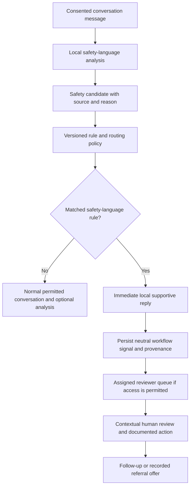

# PamatiAI safety protocol

## Purpose and boundaries

PamatiAI supports a conservative, **human-reviewed support workflow**, not psychiatric diagnosis, clinical triage validation or automated emergency dispatch. It does not label students as depressed, suicidal or having a mental disorder. No score automatically triggers a clinical decision, account restriction, external notification, involuntary referral or disclosure to an unassigned reviewer. Human review can correct context and reopen completed workflow items.

Negative sentiment and explicit safety language are different inputs. A negative estimate, even a persistent longitudinal change, does not automatically create an urgent signal. Conversely, potentially urgent language receives supportive guidance even when sentiment models are disabled, unavailable, misleading or positive. No audio, visual or longitudinal modality is required.

## Processing stages



Conversation submission requires active text-processing consent and acknowledgment of the configured local safety processor. The safety disclosure is versioned alongside the conversational processor. Evaluation occurs only after authorization, before calling a remote conversation provider or sentiment model. The rule path is bounded and synchronous. A matched urgent or prompt concern saves a predefined supportive response and signal in the same transaction, then returns immediately. It does not wait for sentiment analyses or trends. Optional sentiment jobs are not created for these routed turns; the local safety analysis itself has source/rule provenance. An existing pending conversational response is finalized with the normal fallback so an urgent new turn is not blocked behind it; an in-flight provider cannot overwrite that finalized response.

The student is directed toward appropriate local emergency/crisis services and a trusted person when immediate danger may be present, rather than waiting for this chat. Messages do not assert that the student has a condition, that immediate intent has been established, or that someone has been contacted. This service cannot dispatch help and cannot guarantee immediate human review. Institutions must maintain operational escalation procedures and human staffing separately.

## Research-oriented rules and policy

`backend/services/safety/policy.py` separates language analysis into `SafetyCandidate` observations and policy evaluation into permitted categories/priorities. `LiteralSafetyAnalyzer` is a deterministic, English literal-phrase baseline, **not an LLM, validated clinical detector or sentiment classifier**. It normalizes Unicode with NFKC, casefolds text, normalizes apostrophes and matches bounded token-separated literal phrases. User-configured regular expressions are not executed.

Default categories are neutral evidence terms:

- `self_harm_language`: explicit language that warrants contextual human attention; it does not establish intent or diagnose a student.
- `immediate_danger`: explicit language about possible immediate danger, including danger involving someone else.
- `safety_concern`: language about not feeling safe, routed for prompt attention.

Rules decide `urgent` or `prompt` **handling priority**, not a validated probability of harm. Matching candidates are evaluated against permitted policy rules. Diagnostic or general-negative-sentiment categories are not accepted. Several matching rules in the same category create one item at the strongest configured priority. The recorded matched rule ID, full policy snapshot, analyzer version and policy SHA-256 identify the evaluation. Literal-match confidence is null, with `unavailable_literal_rule_not_calibrated`; no artificial probability or clinical certainty is assigned.

The supplied defaults can miss urgent language. They also produce false positives for quotations, historical discussion, hyperbole, educational material, negation beyond literal phrase boundaries and third-person references. A quotation is not silently classified as safe: it receives conditional guidance and can be closed after human contextual review. Explicit negated phrases such as “I don't want to die” do not match the corresponding positive literal default, but this does **not** establish safety. Absence of a match is never presented as a safety clearance. Positive sentiment cannot suppress a matched safety-language rule.

Sarcasm, euphemism, spelling variation, multilingual/code-switched language, dialect, culture, disability/accessibility and domain shift are substantial limitations. No claim of comprehensive detection, clinical sensitivity/specificity or jurisdictional compliance is made. Institutions must validate rules and any replacement analyzer with appropriately approved multilingual/contextual evaluations, failure monitoring and human review. Replace or extend the analyzer in versioned code while preserving the candidate/policy separation; no learned safety model is supplied.

## Configuration and contact directory

Configuration uses validated backend settings and Docker Compose environment variables:

```dotenv
SAFETY_POLICY={}
SAFETY_RESOURCES=[]
```

An empty policy object uses the default versioned literal rules. To replace them explicitly:

```json
{
  "version": "institution-policy-2",
  "rules": [
    {
      "id": "approved-danger-language",
      "category": "immediate_danger",
      "priority": "urgent",
      "phrases": ["institution-approved explicit danger phrase"]
    }
  ]
}
```

Rules are bounded to 30, each containing at most 30 literal phrases of 4–160 characters. IDs must be unique. The policy cannot be configured with diagnostic categories. Replacing `rules` replaces the default set; operators must assess lost language coverage rather than assume it is retained. Rule/configuration changes require renewed processor-disclosure acknowledgment before new conversation processing. Settings are deployment configuration: restart/reload the backend after updating the environment. Contact-directory changes do not require renewed analysis consent and apply to new responses after configuration reload.

Each directory entry supplies an institution, jurisdiction and operator-verified contact details:

```json
{
  "id": "campus-support",
  "label": "Institution-approved support service",
  "kind": "campus",
  "institution": "Your institution",
  "jurisdiction": "Applicable jurisdiction",
  "phone": "",
  "url": "https://your-institution.example/support",
  "availability": "Institution-confirmed hours and accessibility arrangements"
}
```

Kinds are `emergency`, `crisis`, `campus`, or `trusted_support`. Configure up to 16 unique resources appropriate to the deployed institution and jurisdiction; do not present an overseas resource as local. The software does not infer a student's location, verify service operation or guarantee availability. Institutions must verify numbers, HTTPS links, hours, eligibility, language/accessibility provisions and review dates through their own operational process. Credentials and non-HTTPS URLs are rejected. No telephone number is hard-coded. If the directory is empty/unavailable, general local-emergency/trusted-person guidance remains visible; the software does not invent contacts.

`GET /api/v1/safety/resources` is public and returns only the configured directory and general guidance. The frontend cookie gateway supports public contact-directory reads. Contact panels are available in chat Help and on the student's records page, independent of text/tracking consent and model execution. Viewing a directory never places a call or sends a message.

## Persisted workflow and consent

Migration `0008_safety_workflow` extends existing `RiskSignal`, `HumanReview` and `ReferralRecord` workflows. Apply `alembic upgrade head` from `backend` before using the new backend against an existing database; Docker's migration service applies the head on startup.

Risk signals retain:

- Student-owned message, inference or trend source; new native signals use the message directly.
- Original processing consent receipt, reason category, priority and creation timestamp.
- Analyzer/rule version, immutable policy fingerprint and policy snapshot.
- Confidence where meaningful (null for literal rules).
- Workflow state, derived human-review status, handling reviewer and revision.

Message-source insertion guards require a live student-owned message and current text-processing consent. Database provenance guards prevent reassignment of source, student, consent receipt, reason/rule version and confidence. Review actions do not rewrite the source message or rule evidence. Signal explanations avoid duplicating message text; an authorized reviewer can retrieve the live source text for contextual review. Audit events contain actor/action/resource references, not source text or reviewer notes.

Current reviewer-access permission and an active assignment are mandatory for queue access and every reviewer action. Administrator status alone does not allow reading or acting on student records. Declining reviewer access does not block immediate supportive messaging, silently grant access or automatically assign a counselor. A signal can remain stored but inaccessible to reviewers until permission and assignment exist. Withdrawal blocks new analysis/reviewer access; it does not automatically erase historical records. Existing privacy/export/retention processes remain separate. Deleted or hidden source records are excluded from the queue and cannot be reviewed/referred through the new workflow.

## States and documented human actions

| State | Meaning |
|---|---|
| `new` | A policy-routed language observation awaits contextual human attention. |
| `under_review` | An authorized reviewer has begun review or documented follow-up; a proposed referral is still here. |
| `referred` | A handling reviewer recorded a specific follow-up offer after a referral decision. This does not mean a service was contacted or care received. |
| `resolved` | A reviewer completed the workflow after documenting context. This is not a declaration that a student is clinically safe. |

New message-source items require the current `expected_revision` and nonblank notes for every review action. Row/current-consent/assignment locks and revision checks reject stale updates and competing active reviewer claims. An authorized reviewer can take over only when the former handling reviewer's assignment is no longer active. Actions append `HumanReview` records with reviewer, decision, timestamp, prior/next state and signal revision:

- `acknowledge` / `follow_up`: begin or continue contextual review.
- `refer`: record a referral proposal; stay under review until a specific offer is recorded.
- `resolve` / `dismiss`: complete or close after contextual review, with documented rationale.
- `reopen`: return a resolved/referred item to new for further review, preserving history.

Completed items must be reopened before another review decision. Offering a referral requires the handling reviewer's still-current `refer` decision and an institution-configured resource ID. Native offers start as `offered`, never automatically accepted. Only the student records acceptance/refusal through the student-choice endpoint; this records preference, not clinical consent or proof of treatment. Reviewers may close native offers only with documented notes, adding an audited follow-up record. Native acceptance/refusal cannot be fabricated by the reviewer endpoint. Legacy inference/trend-source records preserve compatible review/referral behavior and free-text service references; new source/provenance/state checks apply where described.

No action automatically contacts family, police, emergency responders, a clinician or a referral service. Such institutional actions require separately established professional procedures, authority, consent/legal basis and documentation; this implementation does not make those determinations.

## API and reviewer workspace

- `GET /api/v1/reviewer/safety-queue?state=new&offset=0&limit=30`: assigned, currently permitted items; urgent handling first, then prompt, then routine; bounded pagination. Returns source metadata, reason/version, confidence, workflow/human-review state and revision, not diagnostic labels.
- `GET /api/v1/safety-signals/{id}/workflow`: authorized live source context, action history and referrals.
- `POST /api/v1/safety-signals/{id}/reviews`: `{ "decision": "acknowledge", "notes": "Documented contextual review", "expected_revision": 1 }`.
- `POST /api/v1/students/{student_id}/referrals`: a current `human_review_id` and configured `service_reference` after a `refer` decision.
- `PATCH /api/v1/referrals/{id}`: reviewer-recorded offer closure; native closures require notes.
- `GET /api/v1/students/{student_id}/safety-follow-ups`: bounded student-visible offers without internal review notes or diagnostic narratives.
- `PATCH /api/v1/students/{student_id}/safety-follow-ups/{id}`: student choice (`accepted`/`declined`) plus `expected_status` to reject changed offers.

The reviewer workspace is `/reviewer/safety`, with queue state filters, pagination, source context, documented actions and resource selection. Student records show follow-up offers and allow the student to record a choice. The existing cookie gateway enforces Origin on mutations and keeps authentication tokens out of browser-visible responses. Every queue read, workflow read, reviewer action, offer and student choice is audited.

## Operations, failure modes and testing

The queue is not continuously monitored and does not guarantee an urgent response time. Institutions must define coverage, escalation ownership, downtime procedures, response targets and verified emergency alternatives. A failed sentiment/provider service does not delay a matched local safety response. Database/storage failure still prevents reliably recording a turn; this prototype cannot promise emergency continuity during server failure. Always-visible generic contact guidance helps users seek help outside the chat. Policy changes, missing consent or invalid configuration can prevent new analysis; the contact directory/general guidance remains a separate non-analysis capability. Do not bypass consent or silently disclose content to compensate.

Migration SQL can be generated offline for review. Live MySQL integration tests require a dedicated `TEST_DATABASE_URL` ending in `_test`; SQLite tests alone do not validate MySQL trigger execution. Downgrade reinstates old source/decision checks first and refuses incompatible message-only records or new review decisions rather than silently discarding their provenance. Back up and plan an explicit data-preserving migration if rollback is needed.

Safety tests cover explicit danger language, case/Unicode/whitespace variations, general negative sentiment, selected negations, unrelated phrases, quoted-context review, forbidden diagnostic categories, configurable rules/resources, absent text consent, immediate replies without providers/models, pending-turn bypass, idempotency, state transitions, notes/revision requirements, claim conflicts, stale referral proposals, reviewer authorization/withdrawal/source deletion, student-only choices, audit privacy and migration SQL guards. Passing software tests does not demonstrate clinical validity, comprehensive detection or legal compliance.
